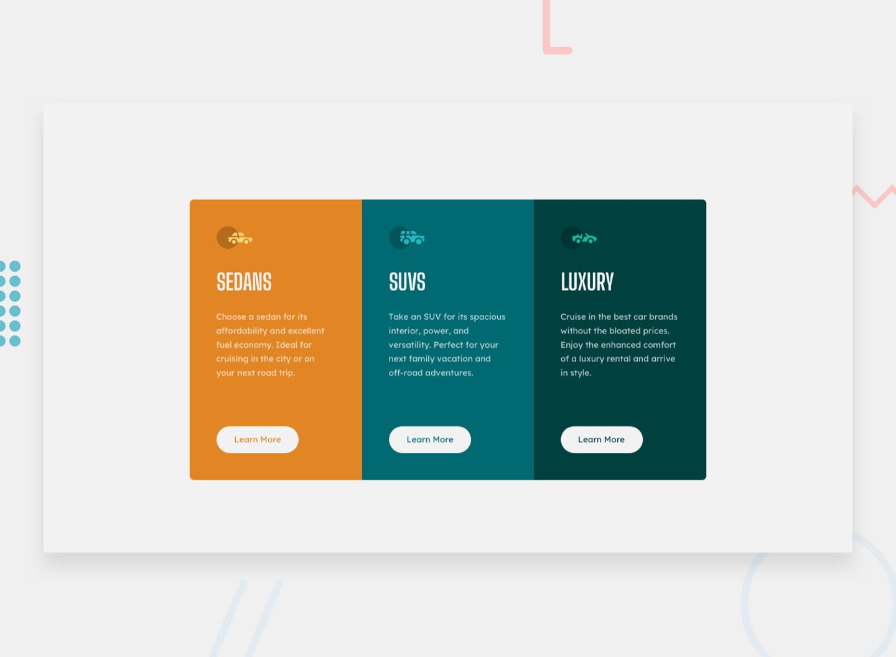

# Frontend Mentor - 3-column preview card component

This is a solution to the [3-column preview card component challenge on Frontend Mentor](https://www.frontendmentor.io/challenges/3column-preview-card-component-pH92eAR2-). Frontend Mentor challenges help you improve your coding skills by building realistic projects.

## Table of contents

- [Overview](#overview)
  - [Screenshot](#screenshot)
  - [Links](#links)
- [My process](#my-process)
  - [Built with](#built-with)
  - [Extra feature](#extra-feature)
  - [What I learned](#what-i-learned)

## Overview

### Screenshot



### Links

- [Solution URL](https://github.com/MATBMS/3-column-preview-card)
- [Live Site URL](https://matbms-3-column-preview-card.netlify.app/)

## My process

### Built with

- Semantic HTML5 markup
- CSS custom properties
- Flexbox
- CSS Grid
- Mobile-first workflow

### Extra feature

As a visitor browsing the car category cards on desktop,<br>
I want visual feedback on the whole group when I hover a card,<br>
So that I can tell at a glance which category I'm about to engage with.

### What I learned

The `:has()` pseudo-class — sometimes called the "parent selector" — lets an element react to what's happening inside it. I used it to drive the hover effect for the extra feature: instead of putting a `:hover` on each card and styling that card, I put a single rule on the container that activates when any of its children is hovered.

```css
.cards:has(.card--sedans:hover) {
  box-shadow: 0 24px 48px -8px var(--color-gold-500);
}
```

Read as: "select `.cards` **when** it contains a `.card--sedans` that is being hovered." That meant the whole cards group could light up in the hovered card's signature color, all in pure CSS with no JavaScript.
